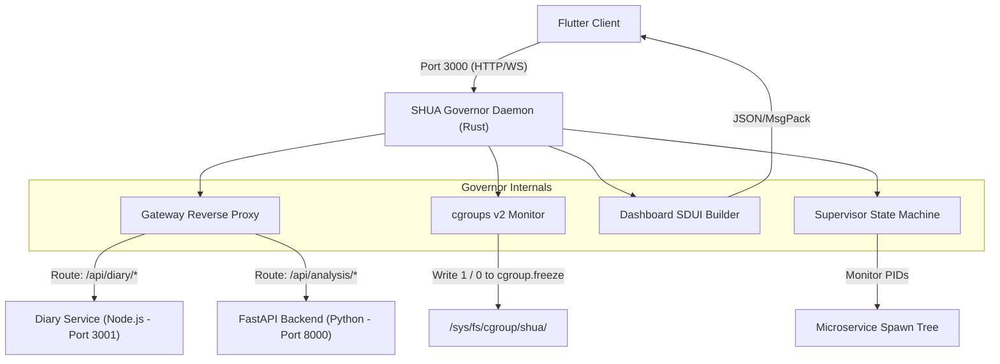

# S.H.U.A. Governor Core: Architecture & Implementation Masterplan
Version: 2.0.0
Author: Principal Systems Architect

This document details the architectural blueprint, systems-level mechanics, and strict operational constraints of the **SHUA Governor** (`shua_governor`), a native systems-level orchestrator daemon written in **Rust** designed to run on the Raspberry Pi 5 under a strict 8.0 GB RAM memory ceiling.

---

## 1. System Vision & Architecture

The Governor functions as the edge-kernel coordinator for our monorepo microservices, implementing a unified API gateway (reverse proxy), kernel cgroups resource supervision, and a dynamic Server-Driven UI (SDUI) layout compiler for client application rendering.



### Core Governor Responsibilities:
1. **Unified API Gateway (Reverse Proxy):** Listen on port `3000`. Expose routing for internal endpoints and proxy foreign routes to underlying servers.
2. **Kernel-level Container Control (cgroups v2):** Use filesystem hooks to govern process trees natively without scheduling jitter.
3. **Low-Overhead Telemetry Daemon:** Periodic polling of procfs `/proc` and cgroups memory files to track memory pressure.
4. **HA Supervisor State Machine:** Manage subprocess lifecycle, crash restart loops with exponential backoff, and state transitions.
5. **Server-Driven Dashboard Compiler:** Serve the dashboard status representation via compact MsgPack streams.

---

## 2. Kernel-Level Resource Control (cgroups v2)

Traditional process management commands such as `kill -STOP` or `kill -CONT` traverse process trees sequentially, resulting in race conditions where child processes continue executing and allocating memory while parent processes are halted. The SHUA Governor forces atomic state freezes using the kernel's native **cgroups v2** filesystem interface.

### 2.1 File System Control Layout
The governor requires delegation of the `/sys/fs/cgroup/shua/` directory.

- **`/sys/fs/cgroup/shua/cgroup.procs`**: Contains all PIDs in the cgroup. The governor writes subprocess PIDs here immediately after spawning.
- **`/sys/fs/cgroup/shua/memory.current`**: The kernel-computed RSS + swap footprint for the entire cgroup in bytes. Read in O(1) time complexity.
- **`/sys/fs/cgroup/shua/cgroup.freeze`**:
  - `1`: Halts all scheduling of threads in the cgroup atomic to the scheduler.
  - `0`: Unfreezes the threads instantly.

### 2.2 Permissions Delegation
To run the daemon as a non-root system user (e.g., `shua`), we configure cgroups delegation during Pi system bootstrap.

```bash
# Setup delegation rule via systemd-tmpfiles or systemd service
sudo mkdir -p /sys/fs/cgroup/shua
sudo chown -R shua:shua /sys/fs/cgroup/shua
```

### 2.3 Memory Ceilings and OOM Prevention
Operating on an 8GB Pi 5, the governor acts as a user-space Out-Of-Memory (OOM) guard, preemptively freezing non-essential services before the Linux kernel OOM killer terminates core system databases.

| Memory Level | Threshold | Action Strategy |
| :--- | :--- | :--- |
| **NOMINAL** | < 7.0 GB | Standard operation. 5-second telemetry sampling. |
| **PRESSURE_WARN** | >= 7.0 GB | Notify client UI via warning banner. Slow sampling to 10s to minimize CPU wakeups. |
| **HARD_LIMIT** | >= 7.5 GB | Freeze secondary modules (`shua_gym_vision`, `shua_crypto`) via `/sys/fs/cgroup/shua/cgroup.freeze` |
| **CRITICAL_LIMIT**| >= 7.8 GB | Freeze the active LLM context and secondary databases. Restrict dashboard telemetry. |

---

## 3. High-Performance Gateway & Reverse Proxy

The Governor acts as the monorepo's API Gateway. To avoid copying buffers between socket readers, we implement a zero-copy routing pipeline using Axum and Hyper.

### 3.1 Path Prefix Routing Map

| Path Pattern | Target Destination | Handler Method | Zero-Copy Payload |
| :--- | :--- | :--- | :--- |
| `/health` | Local Governor | Axum JSON | Yes |
| `/api/dashboard` | Local Governor | Axum MsgPack / JSON | Yes (serde output buffer) |
| `/api/governor/*` | Local Governor | Axum Handler | Yes |
| `/api/diary/*` | `http://127.0.0.1:3001` | Hyper Reverse Proxy | Yes (Stream body) |
| `/api/analysis/*` | `http://127.0.0.1:8000`| Hyper Reverse Proxy | Yes (Stream body) |

### 3.2 Proxy Pipeline Architecture
When routing traffic, the proxy maintains connection pools, forwards client HTTP headers (`Host`, `X-Real-IP`, `X-Forwarded-For`), and directly pipes incoming request streams to outgoing hyper client request streams to prevent reading entire payloads into memory.

---

## 4. High-Availability (HA) Supervisor State Machine

Each microservice registered with the governor is represented as a stateful node in a concurrent state machine.

### 4.1 Process State Transitions
```mermaid
stateDiagram-v2
    [*] --> Stopped : Config Loaded
    Stopped --> Starting : Spawning tokio::process
    Starting --> Active : Process verified (HTTP check/PID check)
    Active --> Frozen : memory.current limit / manual toggle
    Frozen --> Active : manual toggle
    Active --> Stopped : SIGTERM / manual stop
    Active --> Crashed : non-zero exit code
    Crashed --> Backoff : retry limit check
    Backoff --> Starting : timeout expired
    Crashed --> Stopped : backoff limit exceeded
```

### 4.2 Crash & Restart Policies
- **Restart Thresholds**: Max 5 crash attempts within a 5-minute rolling window.
- **Exponential Backoff**: Restart intervals calculated as $t_{retry} = t_{base} \times 2^{attempt}$ where $t_{base} = 1.0\text{s}$, capped at $60\text{s}$.
- **Orphan Prevention**: On daemon termination, the governor issues `SIGTERM` to the cgroup hierarchy, waits $3\text{s}$, and issues `SIGKILL` to clean up remaining zombie processes.

---

## 5. Server-Driven UI (SDUI) Schema & Serialization

The dashboard layout is served from the `/api/dashboard` endpoint using the `SduiNode` schema.

### 5.1 JSON/MsgPack Node Structure
```json
{
  "id": "root_dashboard",
  "t": 35,
  "d": {
    "crossAxisCount": 2,
    "crossAxisSpacing": 16.0,
    "mainAxisSpacing": 16.0
  },
  "items": [
    {
      "id": "card_diary",
      "t": 6,
      "d": {
        "title": "Diary Sync Service",
        "icon": "terminal",
        "state": 0,
        "shimmerStyle": "terminal"
      }
    }
  ]
}
```

- **Type IDs (`t`)**: GridView = `35`, Card = `6`.
- **States**: `0 = ACTIVE` (Green indicator), `1 = FROZEN` (Cyan indicator), `2 = SLEEPING` (Grey indicator).

### 5.2 Network Optimization: MsgPack Frame Serialization
For low-bandwidth wireless client sessions, the governor serializes SDUI payloads to MessagePack (`application/msgpack`).
- Serialization is performed with `rmp-serde` onto a reusable, pre-allocated `Vec<u8>` write buffer to minimize memory allocator calls.
- HTTP `Accept` headers determine if the output is JSON or MsgPack.

### 5.3 Dynamic Blueprint Hot-Reloading & SDUI Caching
To support instant hot-reloading of layouts (such as updates to `schemas/blueprints/dashboard.json`) during local development and remote updates without restarting the systems governor daemon:
- **Loader Mechanism**: The daemon caches the parsed `SduiNode` alongside the file's last modification time (`std::time::SystemTime`).
- **Lazy VFS Checking**: On each GET request to `/api/dashboard`, the daemon queries the file's metadata (`tokio::fs::metadata`) to check the modification time.
- **Cache Invalidation**: 
  - If the modification time on disk matches the cache, it serves the parsed layout directly from memory (zero parsing cost).
  - If they do not match or the cache is empty, the file is reloaded, parsed, and cached.
- **Resource Constraints**: Spawning a persistent background directory watcher (like `notify`) is rejected to preserve system resources, prevent CPU wakeups, and maintain a minimal RAM footprint.

---


## 6. Local Development Sandbox Fallbacks (Cross-Platform)

To support programming and testing on Windows or macOS development environments, the Governor automatically detects the host platform:

- **Linux**: Connects directly to `/sys/fs/cgroup/shua/` interfaces and executes real OS commands.
- **Windows/macOS**: Instantiates a mock directory structural layout under `C:\temp\shua\` or `./mock_cgroup/` to emulate writes to `cgroup.freeze` and reads from `memory.current` with artificial system metrics.
